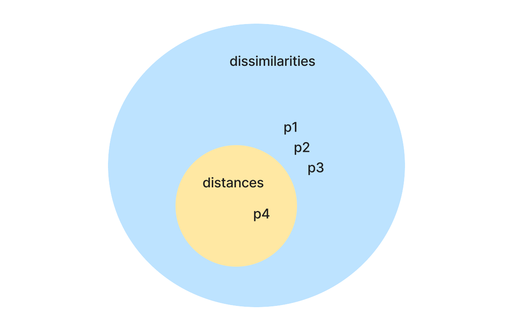
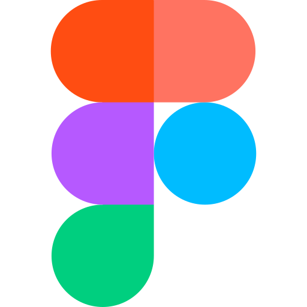

# Machine Learning from scratch

This repository contains implementations of various machine learning algorithms from scratch. The purpose of this repository is to go through the algorithms and practice implementing them in Python. The algorithms are implemented in an object-oriented manner, and the code is well-documented (eventually).  
These will include (but def not limited to):  
- Unsupervised Learning (clustering):  
    - K-means clustering   
    - Hierarchical clustering  
    - Spectral clustering  
- Supervised Learning:  
    - Decision Trees  

Machine Learning is subset of numerical AI revolving around the idea of "learning from data". It optimizes a performance criterion using past data or experience.  
Learning is 2-fold:  
- optimization (training): finding the best model parameters, to make it perform well on the data we have  
- generalization (testing): to make it work on unseen data  

## Unsupervised Learning

This consists of algorithms that do not require labeled data. The main task here is ___clustering___.  
Clustering is about grouping "_similar_" data points together in clusters.  
Similarity is a complex function that can be thought of as the inverse of distance. In fact, dissimilarity is a more general definition of distance, where $\not \exist$ $triangular\ inequality$.
The conditions for a good similarity function $f(x)$:  
1. _Non-negativity_: $f(x,y)\ge 0$
2. _Symmetry_: $f(x, y) = f(y, x)$ 
3. _Reflexivity_: $f(x,x)=f(y,y)=M \ge f(x,y)$ (equal when $x=y$) where $M$ is the max value  

Inverse of the distance, i.e. the more distant $\iff$ the less similar.  
- $d \in [0, +\infty[$  
- $s \in [0, M]$  
- $s(x,y)=f(d(x,y))$; these would work:  
    - $s(x,y)=\frac{1}{d(x,y)+\frac{1}{M}}$  
    - $s(x,y)=\frac{M}{d(x,y)+1}$  
In _ML_, a known function is the $Gaussian\ similarity:$  
$s(x,y)=e^{-\gamma d^2(x,y)} \in ]0,1]$, where $\gamma$ is a scalar.



### K-Means Clustering

K-means clustering is a simple and widely-used clustering algorithm. It is an iterative algorithm that partitions the data into `k` clusters. The algorithm works as follows: 
```text 
1. Initialize `k` cluster centroids randomly.  
2. Assign each data point to the nearest cluster centroid.
3. Update the cluster centroids by taking the mean of all data points assigned to that cluster.
4. Repeat steps 2 and 3 until convergence.
```

### Hierarchical Clustering  

Hierarchical clustering is a clustering algorithm that builds a tree of clusters. The tree is called a _dendrogram_, it can be built via either _agglomerative_ or _divisive_ methods. We will be implementing the agglomerative method. The algorithm works as follows:  
```text
1. Start with `n` clusters, each containing one data point.
2. Find the two closest clusters and merge them into a single cluster.
3. Repeat step 2 until there is only one cluster left.
```

When merging clusters, we need to define a _linkage criterion_ to determine the distance between clusters. The most common linkage criteria are:  
1. _Single linkage_: The distance between two clusters is the distance between the two closest points in the clusters.  
2. _Complete linkage_: The distance between two clusters is the distance between the two farthest points in the clusters.  
3. _Average linkage_: The distance between two clusters is the average distance between all pairs of points in the clusters.  
4. _Centroid linkage_: The distance between two clusters is the distance between the centroids of the clusters.  

### Spectral Clustering
 
_What's the motivation behind?_  
Unlike approaches like k-means, spectral clustering works well on non-convex clusters and can capture complex structures in the data. 
.png)
By definition, in a convex set, if we draw a line between any two points in the set, the line should be entirely within the set. Elements on the line are still on cluster. If it's not convex, elements on the lien dont belong to the same cluster.  
.png)

That's why we're studying _spectral clustering_ which is based _spectral graph theory_: the properties of graphs in relation to the eigenvalues and eigenvectors of the graph's adjacency matrix.  
But, _how to get a graph from tabular data?_  
The data points are represented as vertices in a graph, and the edges between the vertices are weighted based on the similarity between the data points. The graph is a _weighted similarity graph_, which is complete. To sparsify it, a way would be to delete edges with low weights, below a certain threshold $\epsilon$, generating thus an _epsilon-graph_.

_Some linear algebra/graph theory background because it's cool_:  
A Graph $G=(V, E)$ is a set of vertices $V$ and edges $E$ connecting the vertices, it's a non-euclidean data structure _(example of euclidean is tabular data, it obeys euclidean postulates and can be represented in multi-dimensional linear space)._ 
There are 3 types of matrices when it comes to representing them, the most common being:  
- _adjacency matrix_ $A$ which is a square matrix of size $|V| \times |V|$ where $A_{ij} = w_{ij}$ if there is an edge between vertices $i$ and $j$, and $0$ otherwise. The _degree matrix_ $D$, on the side, is a diagonal matrix of size $|V| \times |V|$ where $D_{ii} = \sum_{j} A_{ij}$, i.e. the sum of the weights of the edges incident to vertex $i$, and this can be calculated as $D = \sum_{i} A$.   
- _incidence matrix_ $B$ which is a matrix of size $|V| \times |E|$ where $B_{ij} = 1$ if vertex $i$ is incident to edge $j$, $-1$ if it is the other end of the edge, and $0$ otherwise (each column has 2 non-zero entries, one +1 and one -1).  
- _Laplacian matrix_ $L$ which is a matrix of size $|V| \times |V|$ where $L = D - A$. It is symmetric and semi-positive definite, and has has some interesting properties, the eigenvalues and eigenvectors provide some insights into teh connectivity of the graph.  
The sum of the elements in each row/column is zero, and the smallest eigenvalue is zero with the corresponding eigenvector being the all-ones vector (# of 0 eigenvalues = # of connected components in the graph).   
The eigenvectors are all $\in \mathbb{R}$ and orthogonal (because $L$ is $sym$). 
It's very good for clustering, used to solve the _normalized cut_ problem, which is a relaxation of the _min cut_ NP-complete problem. 

**Definition:**  
Given a graph $G=(V, E)$, the minimum cut problem is to partition the vertices into two sets $A$ and $B$ such that the number of edges between the two sets is minimized. 
$Cut(A, B) = \sum_{i \in A, j \in B} w_{ij}$  
The purpose of clustering is to maximize the distance between the clusters and minimize the distance within the clusters. Thus the min cut problem $\iff$ clustering. 

.png)

According to Reyleigh's theorem, the second smallest eigenvalue of the normalized Laplacian matrix corresponds to the optimal cut of the graph, the eigenvector corresponding to this eigenvalue gives the partition of the graph into two clusters, also called the _Fiedler vector_.


Here in biclustering, the output will be the assignment vector $p$ of size $|V|$ where $p_i = 1$ if vertex $i$ is in cluster 1, and $p_i = -1$ if vertex $i$ is in cluster 2.  
Min-cut is relaxed via the assignment vector $\implies$ $p_i \in \mathbb{R}$ (not discrete, _hence the normalized cut_).  
Then using Rayleigh's theorem, the eigenvector corresponding to teh 2nd smallest $\lambda$ corresponds to the assignment vector, we can then split the values at 0 & apply k-means on this eigenvector.  
In practice, to do k-clustering, we take the first $k$ eigenvectors of the Laplacian matrix, and apply k-means on the resulting matrix.

.png)


This approach eventually leads to a _low-dimensional embedding_ of the data, constructed from the eigenvectors of the graph Laplacian matrix.


The algorithm for _Normalized Spectral Clustering_ (by Ng, Jordan, and Weiss):


Visualizations drawn with <a href='figma.com'>  </a>  
Licensed by the [MIT License](./LICENSE.md).  